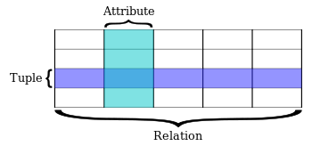

# 🟥 Spring AOP ( Aspect Oriented Programming )

### 정의

AOP는 관점 (Aspect) 지향 프로그래밍으로 관점을 기준으로 다양한 기능을 분리하여 보는 프로그래밍이다.\
\
관점(Aspect)란, 부가 기능과 그 적용처를 정의하고 합쳐서 모듈로 만든 것이다.\
\


### 목적

<figure><figcaption><p><a href="https://velog.io/@kai6666/Spring-Spring-AOP-%EA%B0%9C%EB%85%90">https://velog.io/@kai6666/Spring-Spring-AOP-%EA%B0%9C%EB%85%90</a></p></figcaption></figure>

보통 관심사를 분리하기 위해 Layerd Architecture를 사용할텐데,

이미지와 같이 모든 레이어에 공통적으로 Logging, Security와 같은 기능이 작동해야 한다고 할 때, 쓰인다.




```
프로그래밍을 하다보면 공통적인 기능이 많이 발생한다. 
이러한 공통 기능을 모든 모듈에 적용하기 위해 상속을 이용한다. 
하지만 Java에서는 다중 상속이 불가능하며, 상속을 받아 공통 기능을 부여하기에는 한계가 있다. 
예를 들어 우리가 개발한 API의 호출 시간을 측정하고 싶다고 하자. 
이를 AOP없이 구현한다면 어떻겠는가? AOP를 적용하지 않는다면 중복 코드가 발생할 소지가 있고,
 코드의 변경이 필요하면 여러 코드에 종속적으로 변경이 필요할 것이며, 
핵심적인 비지니스 로직에 호출 시간 측정이라는 부수적인 로직이 추가되어 가독성과 효율성이 
떨어지는 등의 문제가 발생할 수 있다. 
```

출처: [https://mangkyu.tistory.com/121](https://mangkyu.tistory.com/121) \[MangKyu's Diary:티스토리]


즉 객체지향을 위한 부가적으로 도와줄 수 있도록 만든 개념이며, 이와 같은 부가적인 기능을 횡단 관심사라고 한다.

횡단 관심사의 코드를 핵심 비즈니스 로직의 코드와 분리하여, 코드의 간결성을 높이고 변경에 유연함과 무한한 확장이 가능하도록 하는 것이 AOP의 목적이다.
