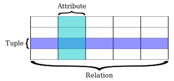

# RDBMS(Relational Database Management System)


관계형 데이터베이스(關係形 Database, Relational Database, [문화어](https://ko.wikipedia.org/wiki/%EB%AC%B8%ED%99%94%EC%96%B4): 관계자료기지, 관계형자료기지, RDB)는 키(key)와 값(value)들의 간단한 관계를 테이블화 시킨 매우 간단한 원칙의 전산정보 [데이터베이스](https://ko.wikipedia.org/wiki/%EB%8D%B0%EC%9D%B4%ED%84%B0%EB%B2%A0%EC%9D%B4%EC%8A%A4)이다.&#x20;


<figure><figcaption></figcaption></figure>

거칠게 표현하자면 하나의 열을 속성을 의미하고 행을 튜플로 구분한다.

이러한 튜플의 집합(Table)을 Relation Model이라고도 부른다.

## 3가지 개념

관계형 모델에서 쓰이는 3개의 개념을 정확히 이해해야한다.

1. Relation&#x20;
2. Tuple
3. Attribute

### Attribute

속성의 경우 열이라고 설명하였는데 엑셀과 같이 해당 열의 이름과 타입을 정해준다고 볼 수 있다.

예를 들면, 이름 / 문자열 나이 / 정수 와 같은게 속성이다.

### Tuple

하나의 행을 튜플이라고 하였는데, (속성,값)의 집합이다.

좀 더 쉽게 설명하자면,  Attribute에서 설명하였 듯.

\[Attribute]\(이름/문자열)/\[Value]\(견우) 와 같다.

위 처럼, Attribute의 이름이 key 값이 되며, RDBMS는 Null도 허용한다.

### Relation

거칠게 표현하면, 하나의 Table 이라 표현할 수 있다.

## 관계 대수

하나 이상의 Relation으로 새로운 Relation을 만들 수 있다.

즉,  People의 정보를 모아둔 Table과 Company 정보를 모아둔 Table이 있다고 가정 해보자.

이 때, People에는 이름 나이 성별 이란 Attribute가 있다고 가정 했을 때.

이름 , 나이 만 보여주는 새로운 Relation을 만들 수 있고. ( 이를 Projection 이라 함 )

또는 나이가 20살 이상 만 보여주는 Tuple을 선택할 수 있다 ( 이를 Selection 이라 함 )

또, 현재 People과 Company의 Table을 각각 참조하여 새로운 Relation을 만들 수 있다 \
( 이를 Cartesian Product 라고 함 )

